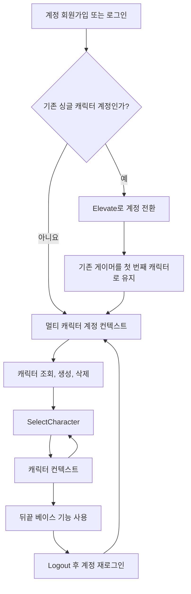

# 멀티 캐릭터란

멀티 캐릭터는 하나의 계정 아래 여러 캐릭터를 만들고, 선택한 캐릭터를 독립된 뒤끝 베이스 유저로 사용하는 기능입니다. RPG처럼 계정 로그인 후 캐릭터 선택 화면을 거쳐 게임에 진입하는 구조에 적합합니다.

멀티 캐릭터에서는 계정 회원가입과 로그인에 `Backend.BMember`를 사용합니다.  
계정에 속한 캐릭터의 조회·생성·선택·삭제는 `Backend.MultiCharacter.Character`를 사용합니다.

## 프로젝트 준비

뒤끝 콘솔 > 개발 > 유저 > 환경설정에서 **멀티캐릭터 활성화** 버튼을 클릭하면 멀티 캐릭터를 활성화할 수 있습니다. 멀티 캐릭터로 변경한 프로젝트는 일반 프로젝트로 되돌릴 수 없으므로 신중히 활성화해 주세요.

## 계정과 캐릭터 컨텍스트

멀티 캐릭터는 계정과 캐릭터의 로그인 상태를 구분합니다.

| 상태 | 확인 속성 | 가능한 작업 |
| --- | --- | --- |
| 로그아웃 | `Backend.IsLogin == false` | 회원가입, 계정 로그인 |
| 전환이 필요한 기존 계정 | `Backend.NeedsElevation == true` | `Backend.BMember.Elevate`로 멀티 캐릭터 계정 전환 |
| 계정 로그인 | `Backend.IsMultiAccountLogin == true` | 캐릭터 목록 조회, 생성, 선택, 삭제 |
| 캐릭터 로그인 | `Backend.IsMultiCharacterLogin == true` | 게임 정보, 리더보드, 우편 등 뒤끝 베이스 기능 사용 |

계정 로그인 상태에서는 캐릭터를 조회·생성·선택·삭제하고, `SelectCharacter`에 성공한 뒤에는 선택한 캐릭터를 기준으로 뒤끝 베이스 기능을 사용합니다. 캐릭터 컨텍스트에서도 계정 권한은 유지되므로, 로그아웃하지 않고 `SelectCharacter`를 다시 호출해 다른 캐릭터로 전환할 수 있습니다.

:::caution NeedsElevation 판정 범위
`Backend.NeedsElevation`은 로그인 응답의 게이머 타입이 미승격 게이머일 때 `true`가 됩니다. 서버 응답만으로는 미승격 레거시 게이머와 멀티 캐릭터를 사용하지 않는 프로젝트의 게이머를 구분할 수 없어, **멀티 캐릭터를 사용하지 않는 프로젝트에서도 로그인 시 항상 `true`** 입니다. 이 경우 `Elevate`를 호출하면 statusCode 403으로 거부됩니다. 멀티 캐릭터 프로젝트에서만 이 값으로 승격 분기를 작성해 주세요.
:::

## 주요 특징

- 회원가입과 로그인은 기존 게임 유저 관리 방식과 동일합니다.
- 기존 싱글 캐릭터 계정은 `Backend.BMember.Elevate`로 멀티 캐릭터 계정으로 전환할 수 있습니다. 전환에 성공하면 기존 게이머를 첫 번째 캐릭터로 유지하고 계정 컨텍스트로 진입하므로, 로그아웃 없이 캐릭터를 조회·생성·선택·삭제할 수 있습니다.
- `Backend.NeedsElevation`, `Backend.IsMultiAccountLogin`, `Backend.IsMultiCharacterLogin`으로 현재 컨텍스트를 구분할 수 있습니다.
- 계정 하나에 캐릭터는 최대 20개까지 생성할 수 있습니다.
- `GetCharacterList()`로 캐릭터 목록만 조회하거나, `GetCharacterList(string tableName)`으로 캐릭터 목록과 각 캐릭터의 최신 게임 정보 한 건을 함께 조회할 수 있습니다.

## 다음 단계

1. [계정 전환](./02-elevate.md)에서 기존 계정을 멀티 캐릭터 계정으로 전환합니다.
2. [캐릭터 관리](./03-character/01-create-character.md)에서 캐릭터 생성, 조회, 선택, 삭제를 구현합니다.
3. 전체 동작은 [Unity 예제 프로젝트](./04-unity-example-project.md)에서 확인할 수 있습니다.
