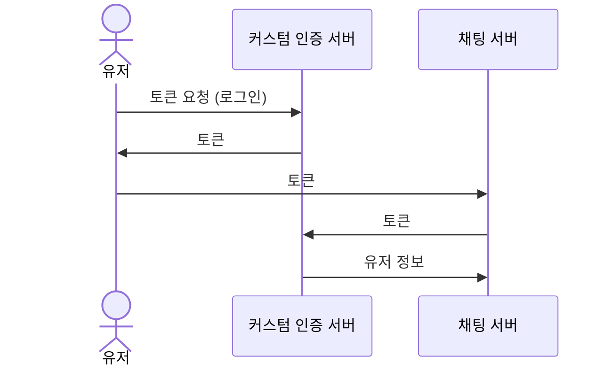
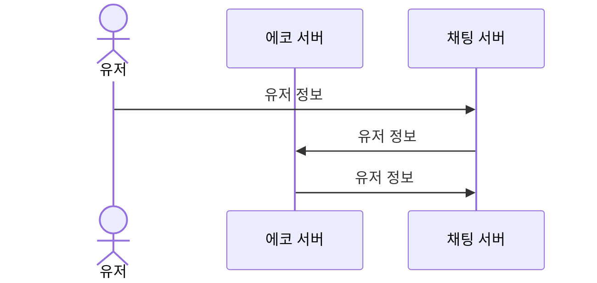

# 커스텀 인증

뒤끝에서 제공하는 인증 서버를 사용하는 대신, 자체적으로 구축한 유저 인증 서버를 채팅 서버와 연결해서 사용할 수 있습니다. 이미 인증 서버와 유저 DB를 구축하고 계신 팀에게 추천합니다. 이 기능을 사용할 경우 유저 관리 호출 비용 및 DB 비용이 청구되지 않습니다. 

## 구조

커스텀 인증 서버로부터 채팅에 필요한 유저 정보를 받는 프로세스입니다.


1. 유저가 로그인을 요청하고, 인증을 완료한 후 커스텀 인증 서버로부터 토큰을 받습니다.  
2. 받은 토큰과 함께 채팅 서버에 접속을 요청합니다.
3. 채팅 서버에서 커스텀 인증 서버로 토큰을 보냅니다.
4. 커스텀 인증 서버에서 유저 정보를 채팅 서버로 넘겨주고, 유저는 채팅 서버에 접속합니다.

<details>
<summary>TIP : 만약 로그인 인증 절차가 필요 없는 게임이라면?</summary>
<div markdown="1">

토큰 대신 유저 정보를 받고 유저 정보를 그대로 반환하는 에코 서버를 활용하여 커스텀 인증 기능을 사용할 수 있습니다.



</div>
</details>

## 사용 방법

연결하고자 하는 커스텀 인증 서버의 엔드 포인트를 뒤끝 콘솔에서 설정하고,  
클라이언트 사이드에서 유저의 토큰으로 채팅 서버에 접속하세요.

### 커스텀 인증 API 설정

콘솔의 채팅 > 설정 메뉴에서 커스텀 서버의 인증 API 엔드 포인트를 설정할 수 있습니다.  


채팅 서버는 아래의 방식으로 HTTP 요청을 합니다.

#### HTTP request

```js
POST https://auth.mygame.com
```

#### Headers

```js
Content-Type: application/json; charset=utf8
token: USER_TOKEN
```

#### Request body

| Property name  | Type           | Value           | Description           |
| :------------ | :--------------- |:--------------- |:--------------- |
| source     | string                | thebackend-chat-api               | 요청한 서버 이름 (뒤끝의 채팅 서버)               |

```json
{
  "source": "thebackend-chat-api",
}
```

#### Responses

형식에 맞는 응답을 반환하도록 구성하세요.  
유저 정보는 string 형식의 `nickname`과 `uid`를 필수로 포함해야 합니다.  
`uid`를 통해 유저를 구분하므로, `uid`는 각 유저에게 부여된 고유 값이어야 합니다.

다음은 커스텀 서버에서 채팅 서버로 보내는 유저 정보 예시입니다.
```json title="Status: 200 OK"
{
    "nickname": "john doe",
    "uid": "1234"
}
```

또한, `language` 항목을 옵션으로 전송할 수 있습니다. `language`를 이용해 번역 기능 및 언어별 채널 기능을 효과적으로 사용할 수 있습니다.  
이때 `language`값은 ISO 639-1 language code 형태를 따라야하며, 국가 코드를 포함할 수 있습니다. ([language code list](https://www.localeplanet.com/dotnet/index.html))
```json title="Status: 200 OK"
{
    "nickname": "john doe",
    "uid": "1234",
    // highlight-next-line
    "language": "en-US"
}
```

유저 간 차단 기능을 사용하시려면 `blockedPlayers`에 차단 된 유저의 `uid`와 `nickname`을 포함 해 주시면 서버에서 채팅 차단 처리가 가능 해 집니다.  
자세한 내용은 ([유저](sdk-docs/unreal-chat/user)) 에서 확인 해 주시길 바랍니다.
```json title="Status: 200 OK"
{
    "nickname": "john doe",
    "uid": "1234",
    "language": "en-US",
    // highlight-next-line
    "blockedPlayers": [
        {
            "uid": "1",
            "nickname": "nickname1"
        }
    ],
}
```

### 채팅 서버 접속

클라이언트 사이드에서는 아래 코드를 통해 인증된 유저의 토큰으로 채팅 서버에 접속하세요.

```cpp
BackndChat::BDChatClientArguments args;
args.UUID = "xxxx-xxxx-xxxxxx-xxxxxxx";
args.CustomAccessToken = USER_TOKEN
args.Avatar = "default";
args.Metadata.insert(std::make_pair("key1", "value1"));
args.Metadata.insert(std::make_pair("key2", "value2"));
args.Metadata.insert(std::make_pair("key3", "value3"));

BackndChat::BDChatMain::Initialize(this, args);
```
